#  To create a group named devops on a Linux server, you can use the following command:

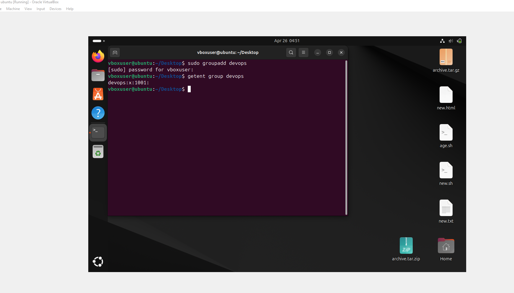

--- This will add a new group called devops. If you want to verify its creation, use:

# Adding user called mary

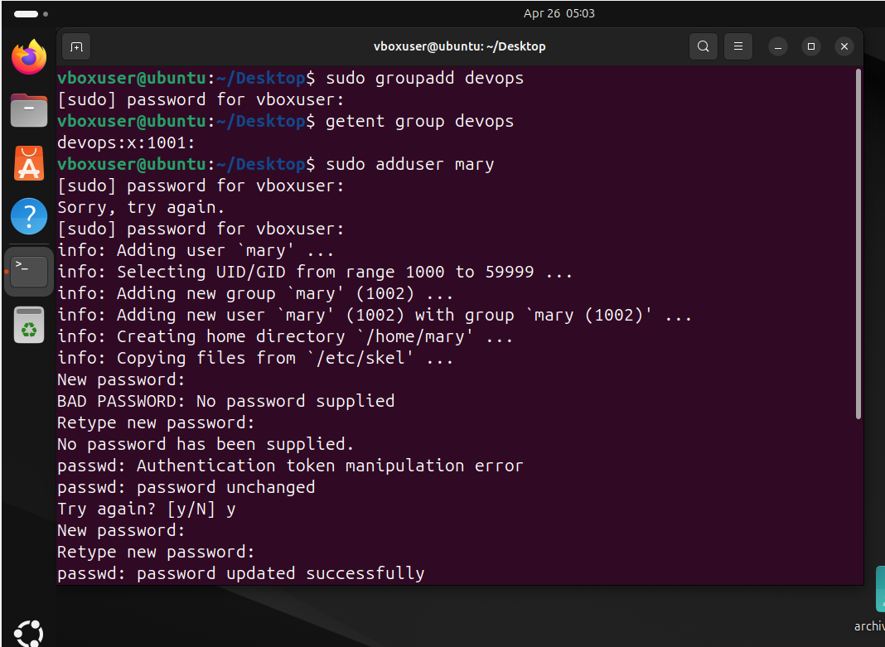

# Adding user called muhammed

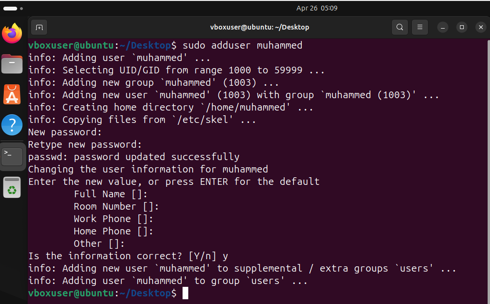

# Adding user called ravi

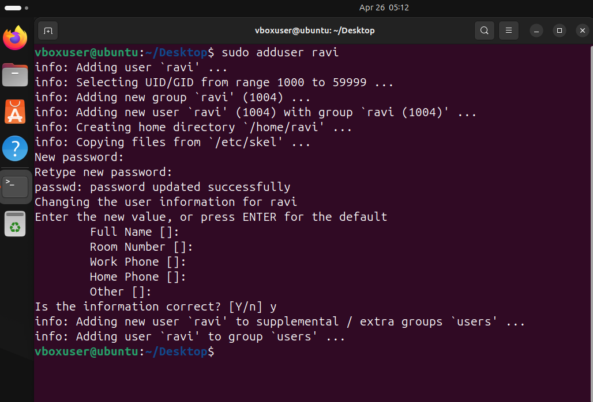

# Adding user called tunji

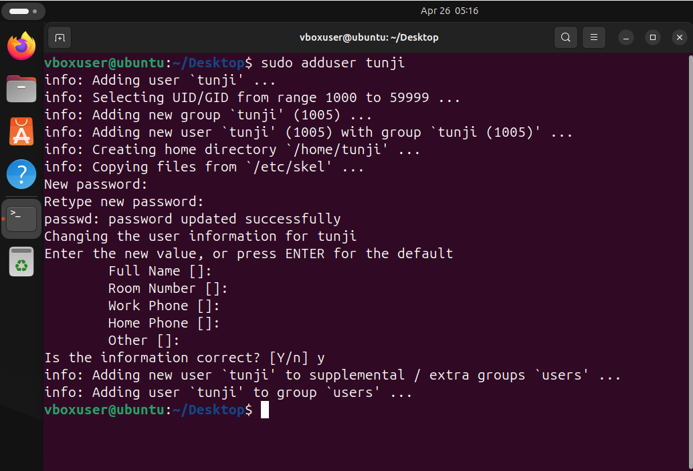

# Adding user called tunji

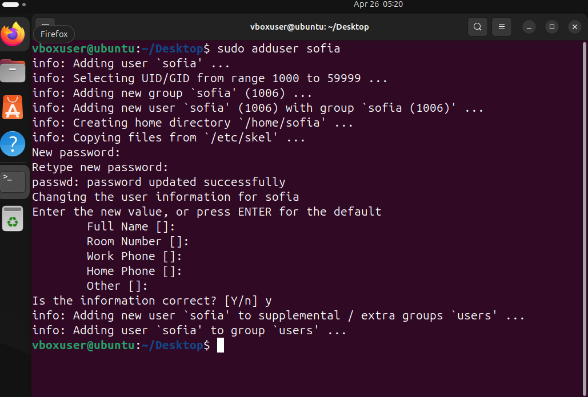

# Adding user called confirm

-- to confirm The users have been created simple type

-- cat /etc/passwd
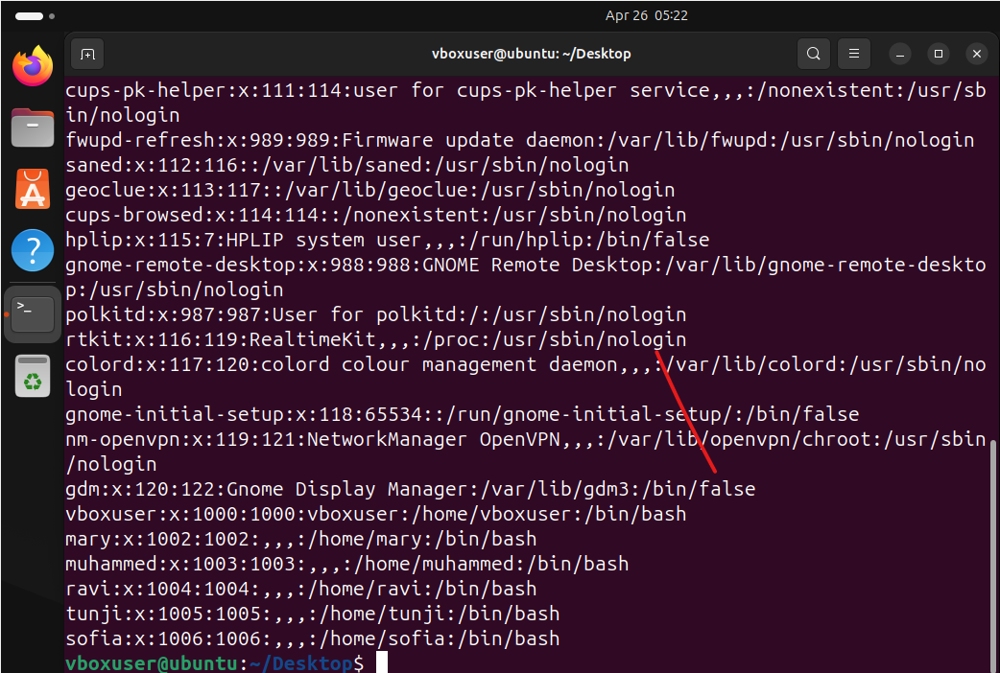

# Creating the home directory for each user

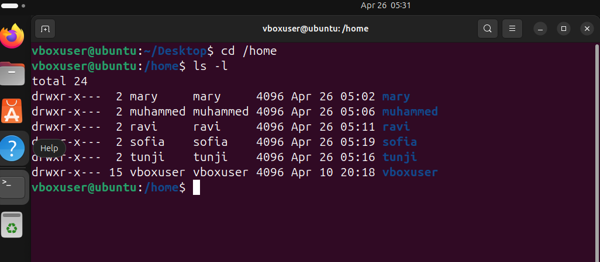

## This is adding mary to the group devops

cat 

## This is adding muhammed to the group devops

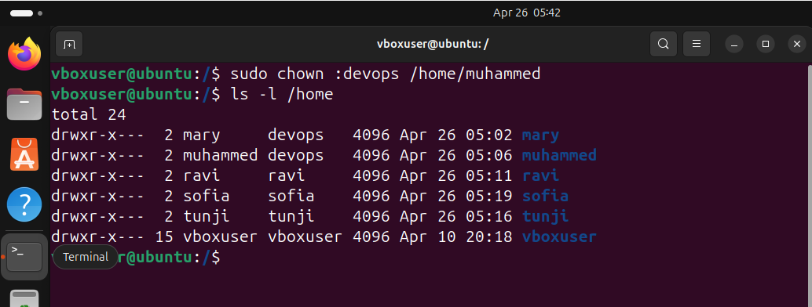

## This is adding ravi to the group devops

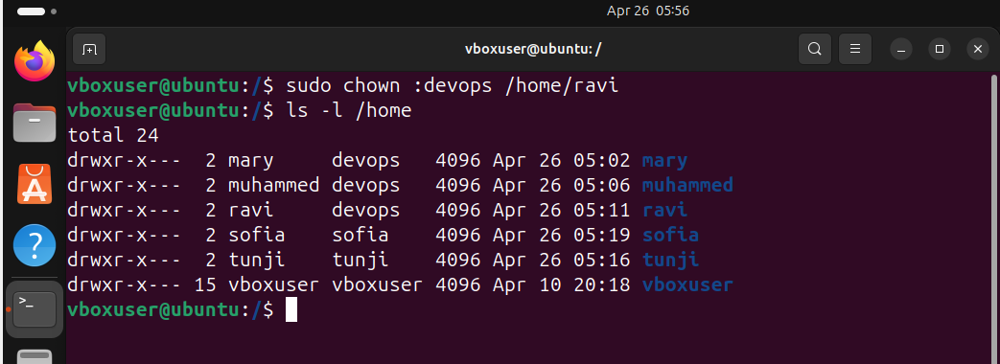

## This is adding sofia to the group devops

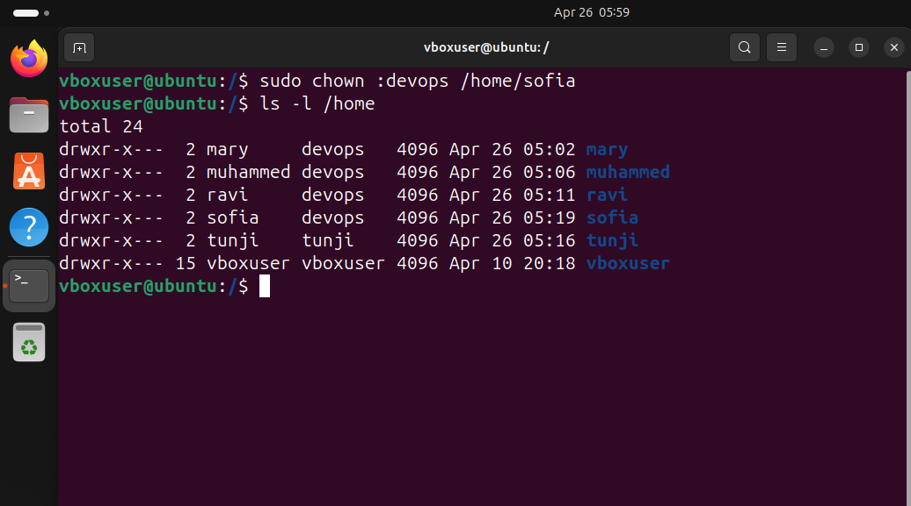

## This is adding tunjic to the group devops

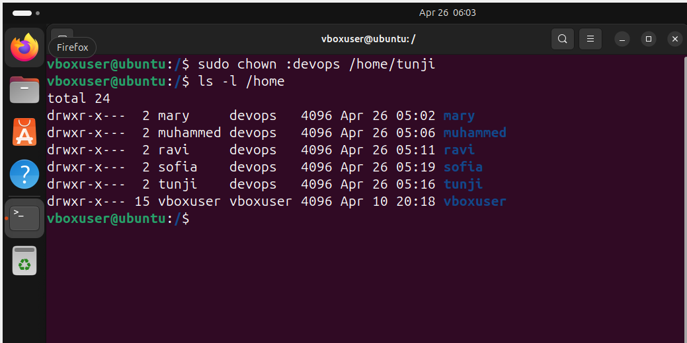

